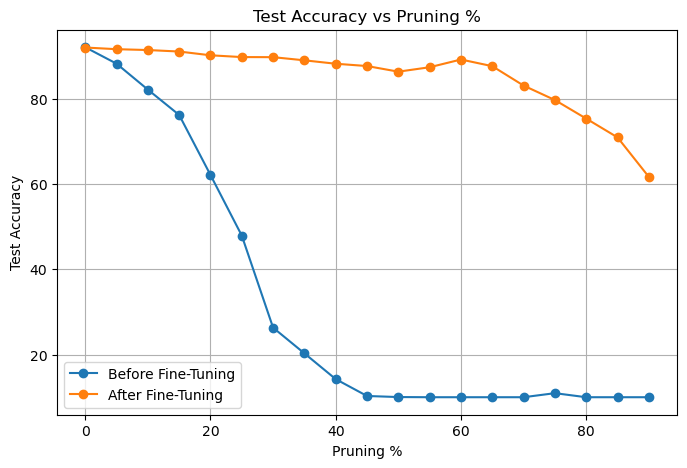
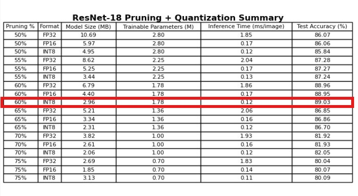

# ResNet-18 Compression for CIFAR-10

This project focuses on compressing **ResNet-18**, a model originally developed for the large-scale ImageNet dataset, to make it efficient for the smaller and more lightweight **CIFAR-10** dataset.

The primary goal is to significantly reduce the model's size and inference time while maintaining competitive classification accuracy.

---

###  Final Results

- **Baseline (uncompressed)**: 42.66 MB, 92.02% accuracy
- **Compressed model size**: 2.96 MB (93.06% compression)
- **Test accuracy**: 89.03%  (2.99% accuracy loss)


These results show that ResNet-18 can be aggressively compressed while still achieving strong performance on CIFAR-10.

---

## Overview

ResNet-18 delivers strong performance on CIFAR-10, achieving **92.02% accuracy** with a model size of **42.66 MB**. However, it is significantly overparameterized for such a small-scale dataset. To make it more efficient and deployment-friendly, we apply a series of compression techniques:

- **Structured pruning** to remove redundant filters and reduce model complexity  
- **Post-training quantization** using TensorRT, with both **FP16** and **INT8** formats  
- **Pruning + quantization pipeline**, where the model is pruned first and then quantized for maximum compression  
- **Automatic Mixed Precision (AMP)** to accelerate training and inference by leveraging tensor cores on modern GPUs  

Together, these techniques significantly reduce model size and latency while preserving competitive accuracy.


## Table of Contents

- [Final Results](#final-results)
- [Overview](#overview)
- [Project Structure](#project-structure)
- [Usage](#usage)
  - [Set up the environment](#set-up-the-environment)
  - [Verify GPU Compatibility](#verify-gpu-compatibility)
  - [Run the Project](#run-the-project)
- [Dependencies](#dependencies)
- [1. Techniques](#1-techniques)
  - [1.1 Baseline Training](#11-baseline-training)
    - [1.1.2 AMP Training](#112-amp-training)
  - [1.2 Structured Pruning](#12-structured-pruning)
  - [1.3 Post-Training Quantization](#13-post-training-quantization)
  - [1.4 Combined Pruning and Quantization](#14-combined-pruning-and-quantization)
- [2. Compressing ResNet-20](#2-compressing-resnet-20)
  - [2.1 Static Quantization of ResNet-20](#21-static-quantization-of-resnet-20)
  - [2.2 Pruning ResNet-20](#22-pruning-resnet-20)
- [3. ResNet-18 vs. ResNet-20: Generalization Capacity](#3-resnet-18-vs-resnet-20-generalization-capacity)
- [4. Results and Conclusions](#4-results-and-conclusions)
  - [Method Summaries](#method-summaries)
  - [Compression Techniques Overview](#compression-techniques-overview)
- [5. Future Work](#5-future-work)
- [6. Citation](#6-citation)
- [7. License](#7license)


## Project Structure
```
compressing_ResNet-18/
├── data/
│ └── prepare_data.py
├── methods/
│ ├── amp.py
│ ├── full_model.py
│ ├── pruning.py
│ ├── pruning_with_quantization.py
│ ├── resnet20_pruning.py
│ ├── resnet20_quantization.py
│ ├── static_quantization_cifar10.py
│ └── static_quantization_cifar100.py
├── results/
│   ├── pruning/
│   ├── pruning_with_quantization/
│   ├── quantization/
│   └── resnet20/
│       ├── pruning/
│       └── quantization/
├── utils/
│ ├── base_model.py
│ ├── base_train.py
│ ├── gpu_info.py
│ └── model_utils.py
├── environment.yml
├── requirements.txt
└── README.md

```

## Usage

> > The environment is designed for **Linux with CUDA 12.x**.  
> Windows users may need to manually install CuPy, and TensorRT manually.

### Set up the environment
If you're using Conda (recommended):

bash
conda env create -f environment.yml
conda activate deep_learn


Alternatively, if you prefer pip:
bash
pip install -r requirements.txt


### Verify GPU Compatibility
Before running any quantization or AMP training, check that your GPU supports INT8, FP16, and AMP by running:
bash
python utils/gpu_info.py


### Run the Project

Each compression method is encapsulated in a script under the methods/ folder. You can run them independently depending on the experiment you'd like to reproduce.


**Example: Train the full ResNet-18 baseline:**
bash
python methods/full_model.py

All outputs including **logs**, **plots**, **tables**, and **trained models** will be saved under the results/ directory, organized by experiment type.


## Dependencies

- Python 3.8  
- PyTorch 1.12 or higher  
- torchvision  
- torch-pruning (from GitHub)  
- TensorRT 8.x  
- CuPy (CUDA 12.x)  
- PyCUDA  
- matplotlib, numpy, scikit-learn, timm

## 1. Techniques

### 1.1 Baseline Training

ResNet-18 was trained from scratch on CIFAR-10 for **100 epochs** using:

- Optimizer: SGD  
- Momentum: 0.9  
- Weight decay: 1e-2  
- Cosine learning rate scheduling   
- Evaluation via get_model_info_extended


#### 1.1.2 AMP Training

To improve training efficiency, we experimented with **Automatic Mixed Precision (AMP)** using PyTorch's torch.cuda.amp.

AMP reduces memory usage by performing selected operations in float16 precision, while keeping critical computations in float32 for numerical stability.

This is especially useful for training larger models like ResNet-18 on limited hardware.

**AMP Training Loss Curve**  


**Results:**
-  **Full Precision**  
  - Test Accuracy: **92.02%**  
  - Avg Epoch Time: **3.93 sec**
-  **AMP**  
  - Test Accuracy: **91.95%**  
  - Avg Epoch Time: **3.66 sec**


> AMP slightly improved training speed and memory usage, but had minimal impact on accuracy.  
 This is likely because the GPU isn’t fully utilized when training ResNet-18 on the small CIFAR-10 dataset.


### 1.2 Structured Pruning

Layer-wise structured pruning was performed using torch-pruning, followed by fine-tuning to recover lost accuracy.

**Pruning results summary**  


**Accuracy vs. Pruning Percentage (ResNet-18)**  


Structured pruning significantly reduces model size and computation while maintaining high accuracy, provided fine-tuning is applied.  
As pruning increases, more aggressive learning rates and more epochs are needed to recover performance.  
Still, extreme pruning degrades accuracy even after retraining.


### 1.3 Post-Training Quantization

We applied static quantization using TensorRT with both FP16 and INT8 precision. Calibration was class-balanced and GPU-accelerated using CuPy.

To evaluate the generalization of our quantization method, we also tested it on **CIFAR-100**, which is a more complex classification task.  
This allowed us to observe whether quantization would result in a stronger drop in accuracy compared to CIFAR-10.

**Quantization results (CIFAR-10)**  


**Quantization results (CIFAR-100)**  


> As expected, CIFAR-100 showed a slightly stronger accuracy drop under INT8 quantization, but overall the model remained robust across both datasets.  
note that that **the FP32 model is also using TensorRT engine and not pytorch**. this allows for a better inference time comparison as now all three models are running the same calculation.


### 1.4 Combined Pruning and Quantization

In this final experiment, we first applied structured pruning to ResNet-18 and then quantized the pruned models using TensorRT.

This two-stage approach provides the strongest compression-to-accuracy tradeoff.

**Best result**:  
- **60% pruning + INT8 quantization**  
- **Model size**: 2.96 MB  
- **Accuracy**: 89.03% on CIFAR-10

This setting gave the highest compression ratio while still outperforming many lightweight models.  
It validates the effectiveness of sequential pruning and quantization for model deployment on low-resource devices.

**Combined results summary**  



note that in this experiment, **the FP32 model is running in the pytorch engine**


### 2. Compressing ResNet-20

In addition to compressing ResNet-18, we also explored techniques to further reduce **ResNet-20**, which is already a compact model tailored for CIFAR-10.

#### 2.1 Static Quantization of ResNet-20

We applied static quantization (FP16 and INT8) using TensorRT to ResNet-20.

**ResNet-20 static quantization results**  


> **Note:** While static quantization technically worked, it offered no real benefit.  
> Because ResNet-20 is already extremely small, the additional memory and compute required for the quantization process outweighed any savings.  
> Static quantization is more suitable for larger models like ResNet-18, where the gains are more substantial.

#### 2.2 Pruning ResNet-20

We also applied structured pruning to ResNet-20 to explore further size reductions.

**ResNet-20 pruning results**  


**Accuracy vs. Pruning Percentage (ResNet-20)**  


While we were able to reduce the model size further, the margin for pruning is much smaller in ResNet-20.  
Accuracy dropped more quickly compared to ResNet-18, showing that over-pruning small models can significantly degrade performance.  

## 3. ResNet-18 vs. ResNet-20: Generalization Capacity

To better understand the difference in capacity between ResNet-18 and ResNet-20, we referenced publicly reported results on the **Tiny ImageNet** dataset, as we did not conduct these experiments ourselves.

Tiny ImageNet contains 200 classes with 64×64 resolution images and presents a much more complex classification task than CIFAR-10 or CIFAR-100.

According to Li et al. [1], **ResNet-18 achieves 68.89%** top-1 accuracy on Tiny ImageNet. In contrast, Yu [2] reports **ResNet-20 achieves only 55.40%**. This significant performance gap illustrates the difference in representational capacity between the two models.

While ResNet-20 is extremely compact and effective for simple tasks like CIFAR-10, it lacks the depth and flexibility needed for more complex datasets. ResNet-18, on the other hand, offers better generalization and can still be efficiently compressed for deployment.


## 4. Results and conclusions 

Through **structured pruning** and **quantization**, we reduced ResNet-18 from **42.66 MB with 92.02% accuracy** to just **2.96 MB with 89.03% accuracy** on CIFAR-10.

For comparison, **ResNet-20** achieves **92.11% accuracy** with only **1.05 MB** - showcasing that even a generic architecture like ResNet-18 can be efficiently compressed to near-specialized levels through model compression techniques.

### Method Summaries:


| Method                     | Model Size (MB)  | Accuracy (%)  | Inference Speed (ms/image)  | Notes                          |
|----------------------------|------------------|---------------|-----------------------------|--------------------------------|
| ResNet-18 Full (FP32)      | 42.66            | 92.02         | 0.61 (TRT), 1.82 (PyTorch)  | Baseline full-precision model  |
| ResNet-18 AMP              | 42.66            | 91.95         |             —               | Training 0.27s faster per epoch|
| ResNet-18 Pruned 60%       | 6.79             | 89.14         | 1.90 (PyTorch)              | After fine-tuning              |
| ResNet-18 INT8 Quantized   | 12.94            | 92.10         | 0.20 (TRT)                  | Post-training quantization     |
| ResNet-18 Pruned + INT8    | 2.96             | 89.03         | 0.12 (TRT)                  | Best compression trade-off     |
| ResNet-20 Full (Reference) | 1.40             | 92.12         | 0.24 (TRT)                  | Designed for CIFAR-10          |


## Compression Techniques Overview

This section summarizes the three main techniques used to compress ResNet-18 for CIFAR-10: **Structured Pruning**, **Post-Training Quantization (PTQ)**, and a **combined approach** that applies both.

### Structured Pruning
Structured pruning removes entire channels or filters from convolutional layers based on their contribution to the model’s output.

- **Advantages:**
  - Reduces model size and FLOPs in a hardware-friendly manner.
  - Maintains a dense matrix structure, enabling GPU acceleration.
  - Accuracy can be largely recovered through fine-tuning.

- **Disadvantages:**
  - Requires careful selection of pruning ratios and fine tuning.
  - Aggressive pruning without retraining causes significant accuracy loss.
  - May not align perfectly with all hardware bottlenecks (e.g., memory bandwidth vs. compute).

### Post-Training Quantization (PTQ)
PTQ reduces the precision of weights and activations (e.g., from FP32 to INT8) *after* training, without modifying the training process.

- **Advantages:**
  - No need to retrain.
  - Offers significant improvements in memory usage and inference latency.
  - Maintains current accuracy level.
  - No need for the original dataset

- **Disadvantages:**
  - Does not benefit from quantization-aware training optimizations.
  - requires TensorRT engine support and cannot be fine-tuned after quantization.

### Pruning + Quantization Combined
This approach applies pruning followed by quantization to maximize compression while minimizing performance loss.

- **Advantages:**
  - Achieves high compression rates with manageable accuracy trade-offs.
  - Balances model size, latency, and test performance.
  - Offers flexibility to meet deployment constraints (e.g., memory or real-time limits).

- **Disadvantages:**
  - Involves a more complex pipeline (prune → fine-tune → quantize).
  - Requires tuning multiple stages for best results.
  - Hardware-specific calibration and profiling may be necessary to unlock full benefits.

## 5. Future Work

This project opens several directions for further exploration:

- **Quantization-aware training (QAT)** to close the remaining accuracy gap under INT8.
- **Adaptive pruning**, adjusting layer-wise sparsity instead of using uniform ratios.
- **Benchmarking on real devices** (e.g., Jetson, Raspberry Pi) to assess true deployment impact.


## 6. Citation

- [1] Li et al., *Boosting Discriminative Visual Representation Learning with Scenario-Agnostic Mixup*, 2022  
- [2] Yu, Hujia. *Deep Convolutional Neural Networks for Tiny ImageNet Classification*, CS231n, Stanford, 2017
- Dadalto, E. *ResNet‑18 pretrained on CIFAR‑100*. Hugging Face. https://huggingface.co/edadaltocg/resnet18_cifar100  
- Chen, Y. *ResNet‑20 (pretrained on CIFAR‑10)* from PyTorch CIFAR Models. GitHub. https://github.com/chenyaofo/pytorch-cifar-models  
- Nguyen‑Phan, H. *PyTorch_CIFAR10* (ResNet‑18 (modified for CIFAR-10, untrained) and hyperparameter settings were adapted from ). GitHub. https://github.com/huyvnphan/PyTorch_CIFAR10


## 7.License

MIT License © 2025 Din Alon
